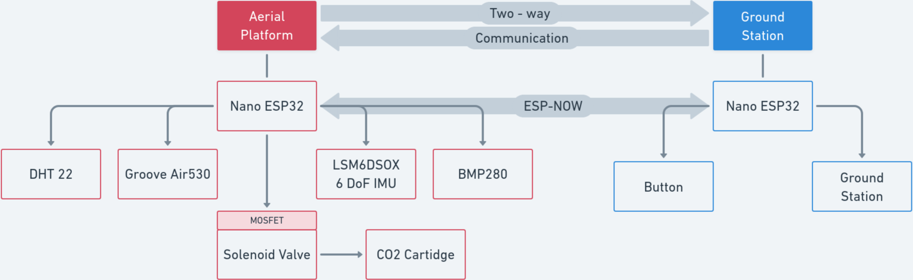
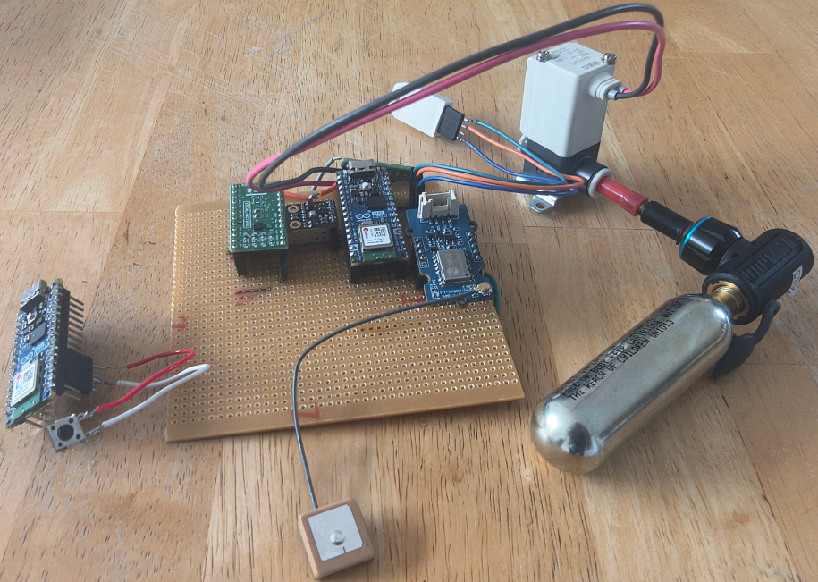

# **Aerial Platform for Acoustics Research**

This repository contains the firmware and supporting software for a drone-mountable embedded platform
designed for airborne acoustic research. The system collects synchronised telemetry and environmental data
and supports remote acoustic actuation for controlled experiments.

## Features

- GPS-based positioning and time-aware telemetry.
- IMU, pressure, temperature and humidity sensing.
- Remote acoustic actuation using a solenoid-driven CO2 cartridge release mechanism.
- Ground side logging support.

## Hardware

- Arduino Nano ESP32
- Seeed Studio Grove GPS Air 530
- LSM6DSOX IMU
- BMP280 Pressure Sensor
- DHT22 Temperature and Humidity Sensor
- SMC VDW20JZ1D Normally Closed Solenoid Valve
- MOSFET driver with a resistor and a Schottky diode.

## Reporitory Structure

- `firmware/` - contains code for the aerial platform.
- `ground_station/` - contains code for receiver and logger.
- `docs/` - contains photographs and schemetics.
- `data/` - contains test output.

